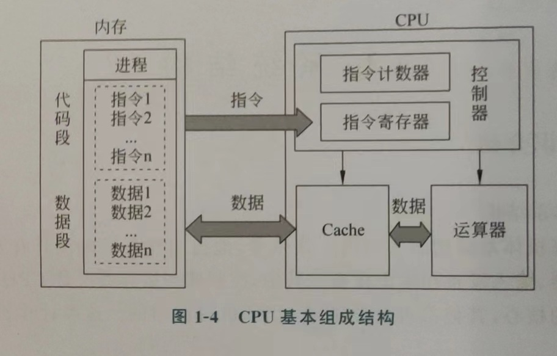

计算机最早的结构是由冯·诺依曼提出的冯·诺依曼结构,而现代计算机中使用的是总线结构

##  冯·诺依曼结构
冯·诺依曼提出的冯·诺依曼结构是最早的计算机结构，它明确了计算机的5大部件（储存器，运算器，控制器，输入设备，输出设备）==其中运算器和控制器组成了CPU, 储存器又是由内存储器（内存），外存储器（硬盘），==Cache==（在现代计算机中被集成在CPU中）==。此处发散一下，CPU能操作直接操作的外设只有内存（寄存器不是外设），操作其他外设时需要通过IO进行操作或操作设备在内存中的映射

## 内存映射

这个更简单，显示器的相关操作就是这样的。 在古早时期，计算机中没有显卡，由CPU来直接控制显示器，此处由两种模式，==文字模式和图形模式==。文字模式就是只能显示文字，想想cmd窗口，那时的电脑就是那样的，全屏黑窗口。而图形模式更为现代，就类似于我们看到的windows系统，可以显示图形化的界面。 无疑文字模式的实现更为简单，在文字模式中内存的==0xB8000-oxBFFFF==（真实地址）的部分就是显存在内存中的映射。只要我们将要输出的文字信息以==ascii码+样式信息==的方式写入到这段内存中，显示器就会出现想要的文字 ==如下代码便是汇编中hello world的实现==

​  
mov ax,0xB800  
mov es,ax   
​  
mov byte [es:0x0000],'h'  
mov byte [es:0x0001],0x07  
   
mov byte [es:0x0002],'e'  
mov byte [es:0x0003],0x07   
   
mov byte [es:0x0004],'l'  
mov byte [es:0x0005],0x07   
   
mov byte [es:0x0006],'l'  
mov byte [es:0x0007],0x07   
   
mov byte [es:0x0008],'o'  
mov byte [es:0x0009],0x07   
   
mov byte [es:0x000A],' '  
mov byte [es:0x000B],0x07   
   
mov byte [es:0x000C],'w'  
mov byte [es:0x000D],0x07   
   
mov byte [es:0x000E],'o'  
mov byte [es:0x000F],0x07   
   
mov byte [es:0x0010],'r'  
mov byte [es:0x0011],0x07   
   
mov byte [es:0x0012],'l'  
mov byte [es:0x0013],0x07   
   
mov byte [es:0x0014],'d'  
mov byte [es:0x0015],0x07 

==Tips：当然通过[[BIOS中断]]进行更简单的实现==

冯·诺依曼结构的示意图如下：

## 五大部件

### CPU

由三个部分组成运算器，控制器，[[Cache]]（==属于储存器==）。

==运算器又称算数逻辑部件（缩写ALU）==主要功能是完成对数据的算术运算，逻辑运算和逻辑判断等操作。

==控制器（缩写CU）==是整个计算机的指挥中心，负责根据事先给定的命令，发出各种控制信号指挥计算机各部分的工作。

### 储存器

- 内存储器
    
    - [[Cache]]
        
    - [[主存]]
        
    - 寄存器
        
- 外存储器（属于输入输出设备）
    

### 输入/输出设备（I/O设备）

- 输入设备：程序和数据等信息都需要通过输入设备送入计算机
    
- 输出设备：计算的结果或各种控制信号需要通过输出设备传送出去。 计算机的I/O设备或装置统称为外部设备，简称外设。 ==CPU与外设连接的电路称之为I/O接口==。
    

程序运行示意图： 

